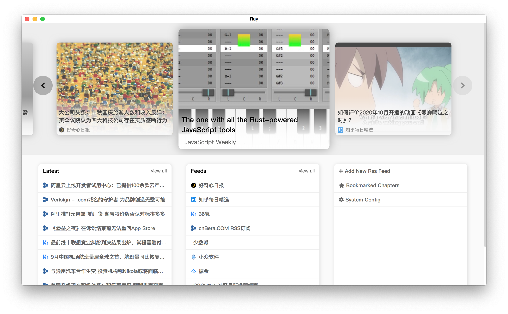
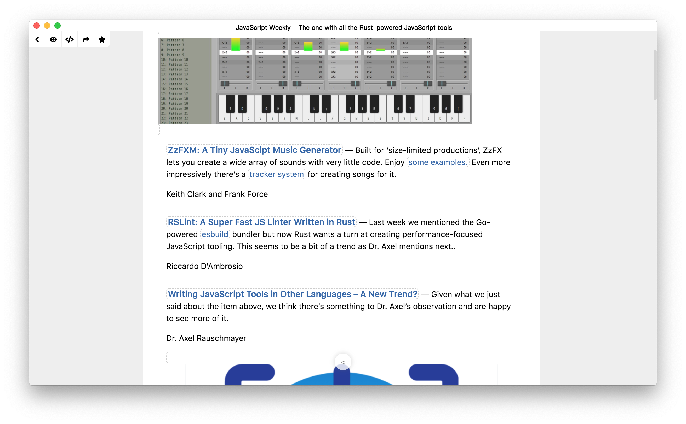

# Ray

`Ray` is about to letting you enjoy pure RSS reading experience

## Install

```shell
npm install
npm run e:build
```

## Features

* Modern UI design
* Feeds management
* Bookmarks
* App configuration
* Reading/Source code mode




## Data Storage

### SS

| Key         | Description     |
| :---------- | :-------------  |
| previewChapter  | 阅读页面所需呈现的文章，结构详见后面说明 |
| feedsViewY  | feeds页面浏览的位置y |
| bookmarksViewY  | 书签页面浏览的位置y |

### `raySavedRssFeeds`

Ray使用源生的LS作为数据存储方式，将当前已存的rss源数据存储在`raySavedRssFeeds`下面，内容为完整JSON字符串，结构如下：

```
[
  {
    id: '', // 前端生成，生成规则 = md5(title + '==' + link)
    active: true, // 是否激活
    title: '', // 名称
    source: '', // feed源
    link: '', // 网址url
    description: '',
    icon: ''
  }
]
```

### `raySavedBookmarks`

Ray使用源生的LS作为数据存储方式，将当前已书签保存的文章数据存储在`raySavedBookmarks`下面，内容为完整JSON字符串，结构如下：

```
[
  {
    id: '', // 前端生成，生成规则 = md5(title + '=!=' + link)
    title: '',
    link: '',
    pubDate: '',
    plainDescription: '', // 前端处理后的纯文本描述，最多100个字符
    avatar: '', // 前端处理得到的首个图片
    description: '', // html原始预览内容
    author: '',
    icon: '',
    rss: { // 结构同rss feed结构
      id: '', // 前端生成，首次添加生成，生成规则 = md5(title + '==' + link)
      title: '',
      source: '',
      link: '',
      description: '',
      icon: ''
    }
  }
]
```

### `raySavedConfig`

Ray使用源生的LS作为数据存储方式，将之前的配置信息存储在`raySavedConfig`下面，内容为完整JSON字符串，结构参考`models/config`

## NOTES

### SS`previewChapter`结构

```
{
  id: '', // 前端生成，生成规则 = md5(title + '=!=' + link)
  title: '',
  link: '',
  pubDate: '',
  plainDescription: '', // 前端处理后的纯文本描述，最多100个字符
  avatar: '', // 前端处理得到的首个图片
  description: '', // html原始预览内容
  author: '',
  icon: '',
  rss: { // 结构同rss feed结构
    id: '', // 前端生成，首次添加生成，生成规则 = md5(title + '==' + link)
    title: '',
    source: '',
    link: '',
    description: '',
    icon: ''
  }
}
```
